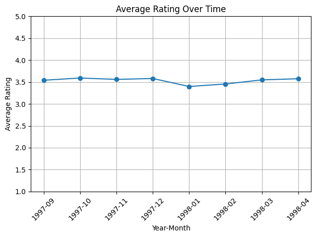

# Practical Machine Learning and Deep Learning - Assignment 2 - Movie Recommender System

## Introduction

This report outlines the development and assessment of a movie recommender system using the MovieLens 100K dataset. By leveraging machine learning techniques and RecTools, the system recommends movies based on user preferences and demographic information. The report details the model's architecture, training process, and evaluation of its performance in suggesting relevant movies to users.

## Data Analysis

Analysis of average review scores across movie genres and user occupations showed preferences among various user groups.

Additionally, the investigation into the number of films released per decade displayed industry growth and audience interests over time.

Furthermore, examining average review scores across temporal dimensions showed shifts in movie ratings over the years or decades.

## Data Preprocessing

The data preprocessing involved several steps for both user and item data. For user data, missing values in the "age", "gender", "occupation", "latitude", and "longitude" columns were handled by replacing them with the mean values or default categories. The "age", "latitude", and "longitude" features were normalized using MinMaxScaler. Categorical variables like "gender" and "occupation" were one-hot encoded. Concerning item data, the "release_date" and "video_release_date" columns were transformed into Unix timestamps and scaled using MinMaxScaler. Missing values in these columns were filled with mean values, and columns related to movie titles and URLs were removed. These preprocessing steps aimed to standardize, encode, and format the data for subsequent analysis and modeling tasks.

## Model Implementation

For the recommendation system in this assignment, I utilized the LightFM which is a hybrid recommendation system library that incorporates both collaborative filtering and content-based approaches to provide recommendations. The model architecture of LightFM combines the advantages of matrix factorization and deep learning techniques, enabling it to handle implicit feedback, explicit feedback, and side information about items and users.

The architecture of LightFM involves the following key components:

1. **Matrix Factorization:**

LightFM utilizes matrix factorization techniques to decompose the user-item interaction matrix into latent feature representations for users and items. It learns low-dimensional embeddings for users and items that capture their latent preferences or characteristics.
Hybrid Approach:

2. **Hybrid Approach:**

LightFM is a hybrid recommendation model that integrates both collaborative filtering and content-based features. It uses a weighted combination of user-item interactions and additional features, such as item metadata or user profiles, to make personalized recommendations.
Embedding Layers:

3. **Embedding Layers:**

The model consists of embedding layers that generate representations (embeddings) for users and items. These embeddings capture latent features and are learned through the training process, aiming to map users and items into a shared latent space.
Interaction between Embeddings:

4. **Interaction between Embeddings:**

LightFM combines user and item embeddings to generate predictions or recommendations. The model computes the interaction between user and item embeddings, considering both explicit and implicit feedback, to predict the likelihood of user-item interactions.

## Model Advantages and Disadvantages

**Advantages:**
1. **Hybrid Approach:** Incorporates collaborative and content-based filtering, improving recommendation accuracy.
2. **Adaptability:** Handles implicit and explicit feedback, making it versatile across various recommendation scenarios.
3. **Scalability:** Efficiently manages large-scale datasets through embedding layers and optimization strategies.

**Disadvantages:**
1. **Complexity:** Hybrid architecture may reduce interpretability of underlying decision-making processes.
2. **Hyperparameter Tuning:** Optimizing diverse components for peak performance can be challenging.

## Training Process

For the training phase, RecTools was employed in implementing the LightFM model, leveraging embeddings with dimensions set to 30. RecTools offers a convenient interface for training recommender systems, and in this instance, it facilitated the setup and execution of the LightFM model. The model utilized embeddings with a dimensionality of 30, indicating the size of the latent factors employed by the model to represent user and item interactions. This dimensionality choice impacts the model's ability to capture nuanced relationships between users and items within the provided dataset.

## Evaluation

The evaluation process involved employing common recommender system evaluation metrics to assess the performance of the LightFM model trained using RecTools. Metrics such as Precision@K and Normalized Discounted Cumulative Gain (NDCG@K) were utilized to measure the model's effectiveness in recommending items to users. The evaluation was conducted on a five-fold cross-validation scheme, splitting the MovieLens 100k dataset into training and test sets.

## Results

The NDCG@K score of around 0.3 and Precision@K of 0.4 signify that the model's rankings of relevant items were relatively good, but there is still room for improvement in capturing user preferences and providing more personalized recommendations.
